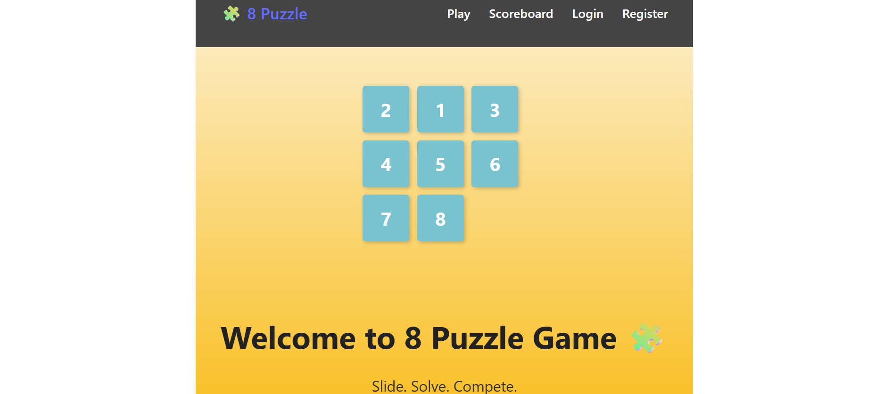
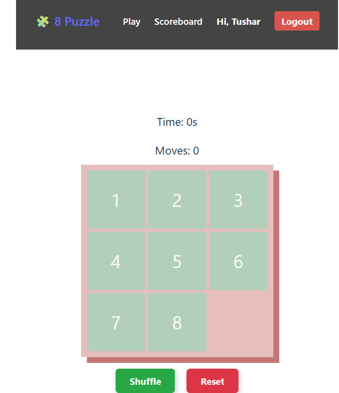
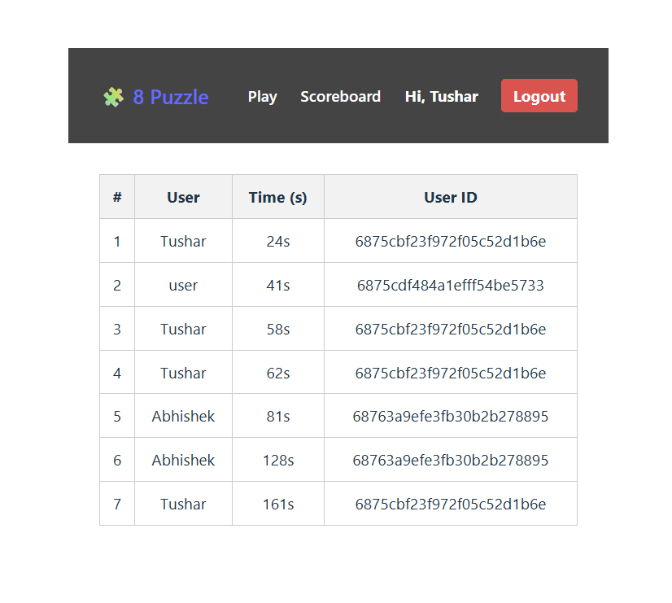

# 8 Puzzle Game 🧩

## Introduction

The 8 Puzzle Game is a full-stack web application built with React (Vite) and Node.js + Express with MongoDB. It allows users to register/login, play the sliding tile puzzle, track their best times, and view a global scoreboard. Designed with animations, protected routes, and a responsive UI, this project is ideal for learning full-stack authentication, puzzle logic, and clean deployment.

## Project Type

Fullstack (React + Node.js + MongoDB)

## Deployed App

Frontend: [https://puzzle-game28.netlify.app/]
Backend: [https://puzzle-pv58.onrender.com]


## Directory Structure

```
puzzle/
├─ controllers/
│  ├─ authController.js
│  └─ scoreController.js
├─ middleware/
│  └─ authMiddleware.js
├─ models/
│  ├─ Score.js
│  └─ User.js
├─ routes/
│  ├─ authRoutes.js
│  └─ scoreRoutes.js
├─ server.js
└─ puzzle-game/
   ├─ public/
   ├─ src/
   │  ├─ components/
   │  │  ├─ Game.css
   │  │  ├─ Game.jsx
   │  │  ├─ Navbar.css
   │  │  ├─ Navbar.jsx
   │  │  └─ ProtectedRoute.jsx
   │  ├─ context/
   │  │  └─ AuthContext.jsx
   │  ├─ pages/
   │  │  ├─ Home.jsx
   │  │  ├─ Home.css
   │  │  ├─ Login.jsx
   │  │  ├─ Register.jsx
   │  │  ├─ Auth.css
   │  │  ├─ Scoreboard.css
   │  │  └─ Scoreboard.jsx
   │  ├─ App.jsx
   │  └─ main.jsx
   └─ .env
```

---

## Features

* 🔐 User authentication (JWT) with protected routes
* 🎮 Interactive 3x3 tile puzzle with animations
* 🕒 Timer and move counter during gameplay
* 🧩 Animated landing page demoing puzzle movement
* 🏆 Scoreboard showing best times of all players
* 📦 Persistent user login using localStorage
* ☁️ Fully deployed with Netlify (frontend) and Render (backend)

---

## Design Decisions or Assumptions

* MongoDB Atlas used for easy deployment and scalability
* JWT used for secure auth with token storage in localStorage
* AuthContext provides global access to login state
* React Router handles protected routing with a PrivateRoute wrapper
* Scoreboard is only accessible to authenticated users

---

## Installation & Getting Started

```bash
git clone "https://github.com/tusharjaiswal28/puzzle.git"
cd puzzle
```

### Frontend Setup

```bash
cd puzzle-game
npm install
# Set API base in .env
VITE_API_URL=http://localhost:5000/api
npm run dev
```

### Backend Setup

```bash
cd backend
npm install
# Set DB + JWT in .env
MONGO_URI=mongodb+srv://<user>:<pass>@cluster.mongodb.net/puzzledb
JWT_SECRET=your_jwt_secret
npm run dev
```

---

## Usage

```bash
# Backend on port 5000
# Frontend on port 5173
```

1. Open the home page (/) to preview the puzzle animation  
2. Register and log in  
3. Shuffle and solve the 8-puzzle  
4. Your time is submitted to the global scoreboard  
5. View scoreboard to see top scores from all users  

---

## APIs Used

* MongoDB Atlas  
* JWT for auth  
* bcryptjs for password hashing  
* Express + Mongoose  
* Netlify & Render for deployment  

---

## Technology Stack

* React.js (Vite)  
* Node.js + Express  
* MongoDB + Mongoose  
* React Router DOM  
* Axios  
* Context API  

---

## Screenshots

| Home Page | Game Page | Scoreboard |
|-----------|-----------|------------|
|  |  |  |


---

## License

MIT License © 2025 [Tushar Jaiswal]
